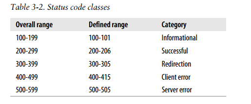
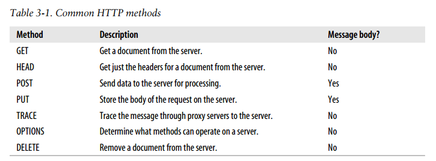
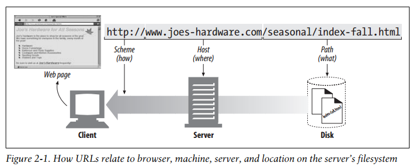

# HTTP The Definitive Guide 读书笔记
> 逆序记录 

| Status  --p59
- 100-199: Informational Status Codes
- 200-299: Success Status Codes
- 300-399:Redirection Status Codes


| The TRACE method is used primarily for diagnostics;
It's also a good tool for seeing the effects of proxies and other applications
on your requests. --p56

| The TRACE method allows clients to see how its request looks when it finally
makes it to the server. --p55

| PUT:
Because PUT allows you to change content, many web servers require you to log in
with a password before you can perform a PUT. --p55

| HEAD METHOD:
The HEAD method behaves exactly like the GET method, but the server returns
only the headers in the response. No entity body is ever returned.
Using HEAD, you can:
- Find out about a resource without getting it.
- See if an object exists, by looking at the status code of the response.
- Test if the resource has been modified, by looking at the headers.
--p54

| The GET and HEAD methods are said to be safe, meaning that no action should
occur as a result of an HTTP request that uses either the GET or HEAD method.
--p53

| HTTP mesages can carry many kinds of digital data:  --p52
- images;
- video;
- HTML documents;
- software applications;
- credit card transactions;
- electronic mail;
- ...

| HTTP headers are classified into:  --p51
- General headers;
- Request headers;
- Response headers;
- Entity headers;
- Extension headers;


| Version:
Note that version numbers are not treated as fractional numbers.
Each number in the version is treated as a separate number.
HTTP/2.22 > HTTP/2.3, because 22 > 3

| The numeric code makes error processing easy for programs, while the reason
phrase is easily understood by humans.(这样的存在总是有意义的)


| The method begins the start line of requests, telling the server what to do.
--p48
- GET
- POST
- PUSH
- DELETE
- HEAD
- TRACE
- OPTIONS


| The headders are terminated by a blank line (CRLF), marking the
end of the list of headers and the beginning of the entity body.
--p47

| messages --p46
request message:
```html
<method> <request-URL> <version>
<headers>

<entity-body>
```

response message:
```html
<version> <status> <reason-phrase>
<headers>

<entity-body>
```

| Both request and response messages have the same basic message structure.
(start line; headers; body) --pp45

| The Parts of a Message: --p44
- a start line describing the message;(Start line)
- a block of headers containing attributes; (Headers)
- an optional body containing data. (Body)

| HTTP messages flow like rivers. All messages flow downstream,regardless of
whether they are request messages or response messages.(所有的消息流都downstream)
The sender of any message is upstream of the receiver.
在图3-2中，代理1是代理3请求的上流，回应的下流。 --p44

| Messages travel inbound to the origin server, and when their work is done,
they travel outbound back to the user agent. --p43

| Describe message direction: --p43
- inbound
- outbound
- upstream
- downstream

| HTTP messages are the blocks of data sent between HTTP applications (clients,
  servers, and proxies). These blocks of data begin with some text `meta-information`
  describing the message contents and meaning, followed by optional data. --p43

| The chapter 3 aim to: --p43
- how to create them;
- how to understand them;

If HTTP is the Internet's courier, HTTP messages are the packages it uses
to move things around. --p43

## CHAPTER 3: HTTP Messages

| https: The https scheme is a twin to the http scheme. The only difference is
  that the https scheme uses Netscape's Secure Sockets Layer (SSL), which provides
  end-to-end encryption of HTTP connnections. Its syntax is idential to that of
  HTTP, with a default port of 443. --p38

| In general, applications interpreting URLs must decode the URLs before
  processing them. --p37

| 字符限制(Character Restrictions)：有些字符是保留的，是有特殊意义的，
  不允许直接在URL中使用。（例如：% / . # ? ; : % + @ & = { } [ ] ~ < >）--p36

| Encoding Mechanisms --p36
- `%7E == ~`
- `%20 == [space]`
- `%25 == %`
- `%40 == -`

| Shady Characters
nonprinting characters also are prohibited in URLs, even though these characters
may pass through mailers and otherwise be portable. --p35

| Expandomatic URLs --p34
two flavors:
- Hostname expansion.(eg. if you type "yahoo" in the address, your browser
  can automatically insert "www." and ".com" onto the hostname)
- History expansion.(eg. if you were typing in the start of a URL that
  you had visited previously, such as `http://www.joes-` your browser
  could suggest `http://www.joes-hardware.com`)
Note: Be aware that URL auto-expansion may behave differently when used with proxies.

| Using this URL as a base, we can infer the missing information. --p32

| Fragments (<frag>): To allow referencing of parts or fragments of a resource,
 URLs support a frag component to identify pieces within a resource. --p30
(精确定位到文档具体位置，这个过程在 client 端进行，而不是 server 端。
  the server sends the entire object and the agent applies the fragment
  identifier to the resource)

| Query component: There is no requirement for the format of the query component, except that some
characters are illegal.(查询组件对格式没有要求，但必须是合法的字符) --p29
跟在 `?` 后面的名值对，多个查询条件用 `&` 分割：`?item=12731&color=blue`

| Auery Strings:
Some resources, such as database services, can be asked questions or queries to
narrow down the type of resource being requested. --p29

| If an application is using a URL scheme that requires a username and password,
such as FTP, it generally will insert a default username and password if
they aren't supplied. --p27

| Scheme names are case-insensitive --p27
(Scheme的名字不区分大小写：例如`http://`和`HTTP://`是等效的)

| The scheme is really the main identifier of how to access a given resource.
--p27

| Most URL schemes base their URL syntax on this nine-part general format: --p26
```
-------------------------------------------------------------------------
<scheme>://<user>:<password>@<host>:<port>/<path>;<params>?<query>#<frag>
-------------------------------------------------------------------------
eg. http://www.joes-hardware.com:80/index.html
```

| Urls give you and your browser all you need to find a piece of
information. They define the particular resource you want,
where it is located, and how to get it.

| 

## CHAPTER 2: URLs and Resources

| Agents
User agents (or just agents) are client programs that make HTTP requests on the
user's behalf. (用来发出HTTP请求的客户端程序，例如：web浏览器) --p19

| Tunnels
HTTP tunnels are often used to transport non-HTTP data over one or more HTTP
connections, without looking at the data. --p19

| Gateways

| Caches

| Proxies
A proxy sits between a client and a server.
Proxies are often used for security, acting as trusted intermediaries
through which all web traffic flows. --p18

## Architectrual Components of the Web

| Protocol Versions --p16
HTTP/0.9 supports only the GET method.
1.0 was the first version of HTTP that was widely deployed.

| An HTTP transaction using telnet:
```sh
[root@localhost ~]# telnet www.lyloou.com 80
Trying 151.101.192.133...
Connected to www.lyloou.com.
Escape character is '^]'.
GET /index.html HTTP/1.1  # input this
Host: www.lyloou.com      # input this
                          # input this

HTTP/1.1 301 Moved Permanently
Server: GitHub.com
Content-Type: text/html
Location: http://lyloou.com/index.html
X-GitHub-Request-Id: 26A4:06EC:8E05E6C:B479C11:58CB8810
Content-Length: 178
Accept-Ranges: bytes
Date: Fri, 17 Mar 2017 06:54:08 GMT
Via: 1.1 varnish
Age: 0
Connection: keep-alive
X-Served-By: cache-lax8651-LAX
X-Cache: MISS
X-Cache-Hits: 0
X-Timer: S1489733648.903540,VS0,VE68
Vary: Accept-Encoding
X-Fastly-Request-ID: b8d3f5bbb2343450fd125b92f1dde483c5109377

<html>
<head><title>301 Moved Permanently</title></head>
<body bgcolor="white">
<center><h1>301 Moved Permanently</h1></center>
<hr><center>nginx</center>
</body>
</html>
```

| Telnet is commonly used for remote terminal sessions, but it can
generally connect to any TCP server, including HTTP servers.

| Establish a TCP/IP connection between the client and server:
- Internet protocol (IP) addresses
- Port numbers

| TCP/IP
Once a TCP connections is established, messages exchanged between the client and
server computers will never be lost, damaged, or received out of order. --p12

| HTTP messages consist of three parts: --p11
1. Start line; (indicating what to do for a request and what happened for a
  response)
2. Header fields; (Note: The headers end with a blank line)
3. Body; (can contain arbitray binary data. eg., images, videos, audio tracks,
  software applications.)

| Messages
- request messages: sent from web clients to web servers.
- response messages: messages from servers to clients.
they are very similar.


| Status Codes
Every HTTP response message comes back with a status code. --p9

| Methods
The method tells the server what action to perform (e.g. fetch a web page,
  delete a file, etc.) --p8
- GET
- POST
- DELETE
- PUT
- HEAD

| Transactions
An HTTP transaction consists of: --p8
- a request command (sent from client to server).
- a response result (sent from the server back to the client)

| URNs
A URNs serves as a unique name for a particular piece of content,
independent of where the resource currently resides.
URNs are still experimental and not yet widely adopted. --p7

| URLs
URLs describe the specific location of a resource on a particular server.
contains three main parts: --p7
- scheme: (e.g., http://)
- server Internet address (e.g., www.lyloou.com)
- names a resource on the web server (e.g., hello.gif)

| URIs
URIs come in two flavors: URLs and URNs.

| Media Types
MIME was originally designed to solve problems encountered in moving messages
between different electronic mail systems.
MIME worked so well for email that HTTP adopted it to describe and label its
own multimedia content. --p5
eg.
- text/HTML
- text/plain
- image/jpeg
- image/gif
- video/quicktime
- application/vnd.ms-powerpoint
https://zh.wikipedia.org/wiki/多用途互聯網郵件擴展

| Resources
- static file: text files, HTML files, Word files, JPEG files, AVI...
- dynamic content: generate content based on your identity, on what
  information you've requested, or on the time of day.(eg. show live image
    from a camera, trade stocks, search databases, buy gifts from online
    stores)

| Because HTTP uses reliable data-transmission protocols, it guarantees that
your data will not be damaged or scrambled in transit, even when it comes from
the other side of the globe. --p3

| Throughout the book, we are careful to explain the "why" of HTTP, not just the
"how".


| There are many books that  explain how to use Web,
but this is the book that explains how the Web works.

| The Definitive Guide is in understanding how the Web works
and how to apply that knowledge to web programming and administration.
