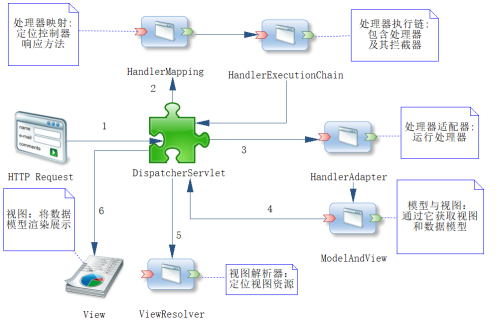

## 流程

## 处理器是如何JSON转换成Java对象
使用的是HttpMessageConverter机制
在这个接口里面有5个方法，canRead, canWrite, write, read, getSupportMediaTypes
在发起http请求的时候，先读取HTTP请求的请求体；
然后在HttpMessageConverter众多实例中（由Spring MVC组织成一条链存放）根据canRead方法来判断实例能否转换，
这样就找到了MappingJackson2HttpMessageConverter实例了，
接着执行read方法，将请求体转换成Java对象。
https://m.imooc.com/collector/read/62

## 参考资料
- [Configure a Spring MVC Project with Intellij IDEA | In My Own Write](https://iamsaurabh.wordpress.com/2017/02/11/configure-a-spring-mvc-project-with-intellij-idea/)
- [Maven + Spring mvc 配置webApp](https://www.jianshu.com/p/bae8f30300c5)
- [spring-mvc-simple-demo](https://github.com/lyloou/spring-mvc-simple-demo)
