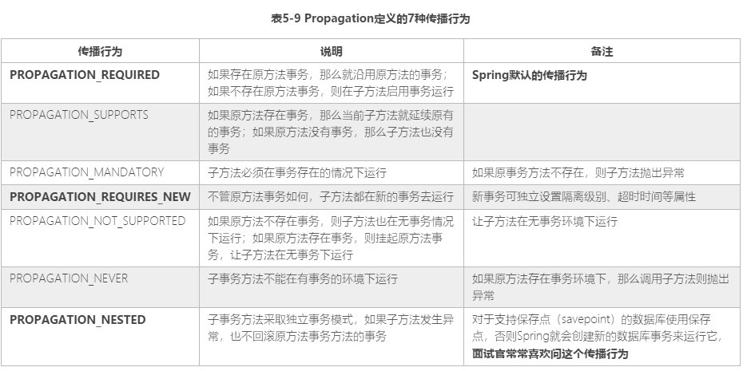

# [面试题](https://m.imooc.com/collector/read/76)

## Spring MVC 的全流程是什么？

https://m.imooc.com/collector/read/60

## 在 Spring MVC 中，为什么 @RequestBody 可以从 JSON 转换出 Java 对象，而 @ResponseBody 可以将控制器返回转换出 JSON 数据集？
HttpMessageConverter<T>
https://m.imooc.com/collector/read/62

## MyBatis 存在哪些组件，各个组件的生命周期是怎么样的，我们应该怎么使用它们？
SqlSessionFactory
SqlSession
Mapper

Configuration
Plugin
TypeHandler
Alias

https://m.imooc.com/collector/read/63

## MyBatis 的 TypeHandler 的作用是什么，我们应该如何使用它？
实现从数据库和POJO之间的相互转换。

使用
1. 实现TypeHandler<T>
2. 注册到MyBatis上下文
3. 在mapper的xml文件中使用：如`#{sex, typeHandler=com.imooc.ssm.typehandler.SexTypeHandler}`

https://m.imooc.com/collector/read/65

## 什么是 MyBatis 插件技术？我们应该如何开发 MyBatis 插件？
通过动态代理的方式来修改MyBatis的底层内容；
插件应用：如分页插件、性能分析插件

开发步骤：
1. 实现Inteceptor
2. 在MyBatis上下文中注册

https://m.imooc.com/collector/read/66

## Spring 数据库事务机制是怎么样的？在什么时候 Spring 会回滚事务？
保证两个操作要么都成功，要么都失败。
Spring 数据库事务流程是通过Spring AOP实现的，而Spring AOP则是通过动态代理技术来实现的。

执行业务的过程中，如果发生异常且满足事务配置，则会回滚事务(rollback)。
如果一切正常或者异常是事务配置允许的，则会提交事务(commit)。

https://m.imooc.com/collector/read/71

## 我们是使用什么注解启用 Spring 数据库事务机制？
`@Transactional`
https://m.imooc.com/collector/read/71

## 数据库隔离级别分为几个，分别是什么？
4个。

未提交读：Read uncommited
提交读：Read commit
可重复读：Repeatable read
序列化：Serializable
https://m.imooc.com/collector/read/73

## 各个隔离级别可能出现什么问题，请举详细实例？

隔离级别\现象 | 脏读 | 不可重复读 | 幻读 |
-----------| ---- | ---------| ---- |
未提交读：Read uncommited | v | v | v |
提交读：Read commit | x | v | v |
可重复读：Repeatable read | x | x | v |
序列化：Serializable | x | x | x |

https://m.imooc.com/collector/read/73

## 不可重复读和序列化两个隔离级别有什么区别？
是否会出现幻读
https://m.imooc.com/collector/read/73

## 我们一般依据什么标准选择隔离级别？
选择隔离级别主要从防止丢失更新和性能两方面来考虑
https://m.imooc.com/collector/read/73

## 一般企业用哪个隔离级别？默认的隔离级别是哪个？Oracle 和 MySQL 对隔离级别的支持情况如何？
一般企业用的是：`提交读：Read`这个级别，它适合在高并发的场景下使用。
默认的隔离级别是：`Isolation.DEFAULT`，Oracle和MySQL有不同的设置：Oracle使用的是`提交读：Read`，MySQL使用的是`可重复读：Repeatable`

MySQL支持全部4个级别；
Oracle只支持`提交读：Read`和`序列化：Serializable`两个级别；

https://m.imooc.com/collector/read/73

## Spring 数据库传播行为有几种？分别是什么？默认的是什么？
7种

默认的是`PROPAGATION_REQUIRED`
https://m.imooc.com/collector/read/74

## 什么场景下使用 NESTED 事务传播行为？
子事务方法采用独立的事务模式，如果子方法发生异常，也不回滚原方法事务方法的事务。
（对于支持保护点(savepoint)的数据库使用保护点，否则Spring就会创建新的数据库事务来运行它）

https://m.imooc.com/collector/read/74

## NESTED 事务和 REQUIRES_NEW 两个传播行为有什么不同？
首先NESTED是延续当前事务，NESTED只是回滚子方法执行过的SQL，而不是全局回滚，但是他不能重新设置事务的属性，
比如不能重新设置事务的隔离级别、超时时间和锁等。
而REQUESTS_NEW会重新建事务，我们可以重新设置事务的属性。
https://m.imooc.com/collector/read/74

