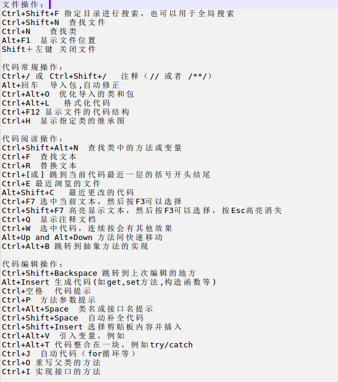
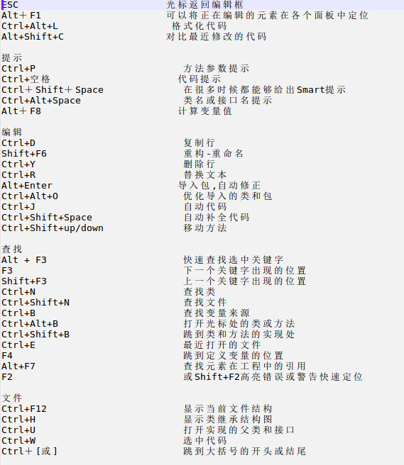

## 摘要：
主要内容：
本文介绍了个人的Android Studio配置，包括主题、插件等；


## 用途
- 编写Android代码；
- 写hexo上的文章；

## 快捷键
- !j
>  Sublime Text式的多处选择（Sublime Text Multi Selection）
>  描述：这个功能超级赞！该操作会识别当前选中字符串，选择下一个同样的字符串，并且添加一个光标。这意味着你可以在同一个文件里拥有多个光标，你可以同时在所有光标处输入任何东西。
>  快捷键：Ctrl + G(OS X)、Alt + Ｊ（Windows、Linux）

- !+insert
> 列选择/块选择（Column Selection）
> 描述：正常选择时，当你向下选择时，会直接将当前行到行尾都选中，而块选择模式下，则是根据鼠标选中的矩形区域来选择。
> 调用：按住Alt，然后拖动鼠标选择。
> 开启/关闭块选择：Menu → Edit → Column Selection Mode
> 快捷键：切换块选择模式：Cmd + Shift + 8(OS X)、Shift + Alt + Insert(Windows/Linux);

- !q 上下文信息；
- ^!m 提取方法；
- ^!p 提取参数（window快捷键冲突）；
- ^!n 内置(inline)，提取的反操作；
- ^+j 合并行和文本；
- ^!t 包裹代码（Surround With）；
- ^+delete 移除包裹代码（包裹代码的反操作）；
- +F4 对当前打开的文件另起一个窗口打开；
- ^+insert: 选择最近复制的内容进行粘贴；
- ^+f: Find in Path
- ^+r: [Find and Replace in Path](https://www.jetbrains.com/help/idea/find-and-replace-in-path.html)
- 
- 

## Theme
- Theme: Darcula
- Font: Fira Code (Enable font ligatures), (14, 1.1)

## Plugin
```sh
# basic
- .ignore
- CamelCase
- GsonFormat
- Markdown support
- BashSupport

# other
- Android ButtkerKnife Zelenzy
- Markdown Navigator
- MultiTypeTemplates
- Smalidea
```

## Tips
- Editor->General->Smart Keys
- 使用 Refector （style）的正确姿势：
    将鼠标定位到要 refector 的标签中（不要选中任何代码），
    然后右键 `Refector --> Extract --> Style...`
- 通过debug的方式调试和查看数据值，而不是通过繁琐地打印日志；

## 提升Gradle编译速度
- 设置代理
``` js
# gradle.properties中添加
# 举例ShadowSocket
systemProp.http.proxyHost=127.0.0.1
systemProp.http.proxyPort=8118
systemProp.https.proxyHost=127.0.0.1
systemProp.https.proxyPort=8118
```
- 设置中启用离线状态
- 启用守护进程
``` js
# gradle.properties中添加
org.gradle.jvmargs=-Xmx2048m -XX:MaxPermSize=512m -XX:+HeapDumpOnOutOfMemoryError -Dfile.encoding=UTF-8
org.gradle.parallel=true
org.gradle.daemon=true
```
- 编译SDK使用21以上

### 外部链接
- [知道Android 中Gradle 的这些技巧，提升编译构建速度](http://tikitoo.github.io/2016/05/26/android-studio-gradle-build-run-faster/)
- [Android Studio 小技巧合集](http://jaeger.itscoder.com/android/2016/02/14/android-studio-tips.html)
- [Android Studio 实用小技巧](https://mp.weixin.qq.com/s?__biz=MzIwMzYwMTk1NA==&mid=2247485764&idx=1&sn=f816c73c1bc0d024d877f5f5371488b7&chksm=96cda809a1ba211faf50e83386c40d74bc71a24bd420f22cffda6a3d62a64ded6b5695a20d59&mpshare=1&scene=23&srcid=0717PkrJrg2LIqVFH25udp60&utm_medium=email&utm_source=gank.io#rd)

## logcat color
search: Logcat
```ini
Assert: 9C27B0
Debug: 2196F3
Error: F44336
Info: 4CAF50
Warning: FFC107
```