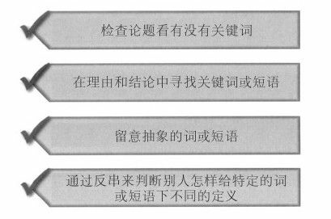

## 学会提问

我们认为，你一定愿意自己掌握主动权，选择该相信什么忽略什么。而要做出决定和 取舍，你就得带着一定的态度去读书，即带着问题去读书。这种思维方式需要你积极主动 地参与进来。作者在向你细说原委，而你则随时准备与之辩驳，虽然作者本人根本就不在 场。

淘金式思维要求读者问自己一系 列既定的问题，旨在找出最佳判断或最合理的看法。

要让你的结论一目了然，这样不仅节省了读者的 精力，而且可以提高文章的逻辑度。
--p40

**一定要当心，千万不要贸然接受你所遇到的事件的第一个解释。**要寻找替代原因，努

力去比较它们的可信度。要考虑采取其他不同视角，这样事件所涉及的利益方就可能会被

考虑进去。阅读事件的多种不同版本来帮助你扩大见解的范围。**我们必须接受这一事实，**

**那就是有很多事件并不是只有一种解释。**
